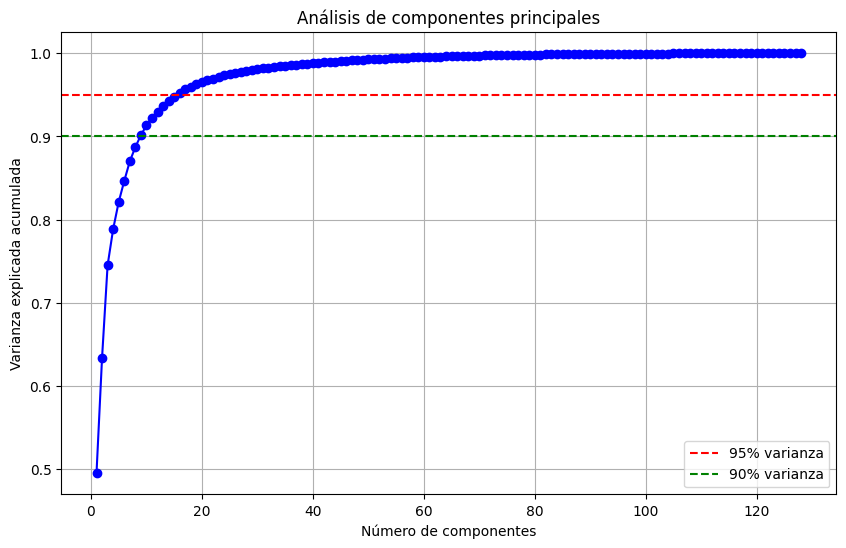
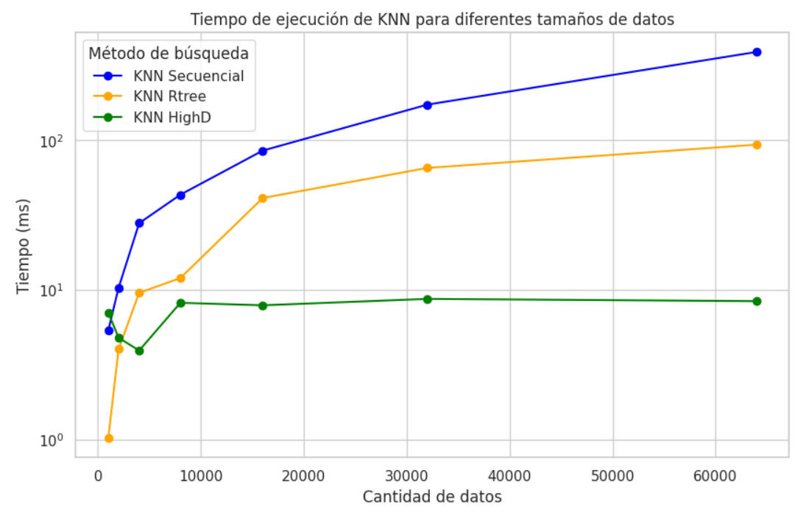
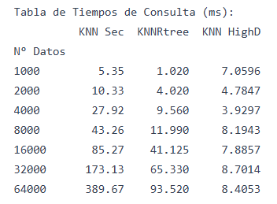
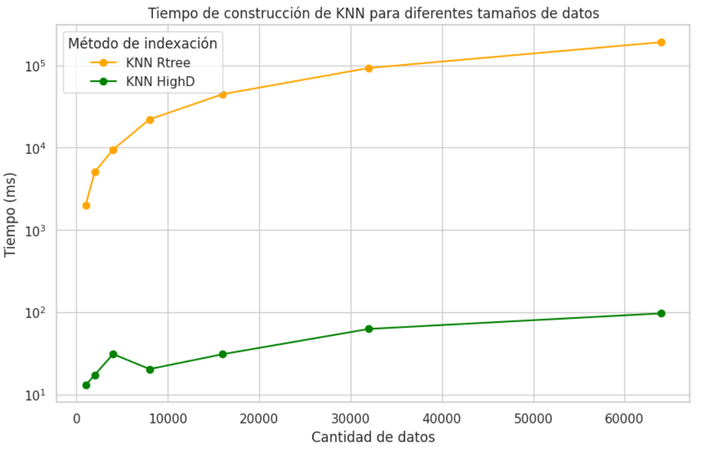
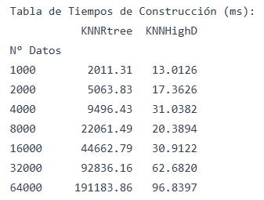

# Proyecto3

### Autores

|                                                                             | Nombre                                                                   | GitHub                                                     |
| --------------------------------------------------------------------------- | ------------------------------------------------------------------------ | ---------------------------------------------------------- |
|                         | [Mariel Carolina Tovar Tolentino](https://github.com/MarielUTEC)         | [@MarielUTEC](https://github.com/MarielUTEC)               |
|                   | [Noemi Alejandra Huarino Anchillo](https://github.com/NoemiHuarino-utec) | [@NoemiHuarino-utec](https://github.com/NoemiHuarino-utec) |
|  | [Sergio Sebastian Sotil Lozada](https://github.com/Sergio-So)            | [@Sergio-So](https://github.com/Sergio-So)                 |
|                     | [Davi Magalhaes Eler](https://github.com/CS-DaviMagalhaes)               | [@CS-DaviMagalhaes](https://github.com/CS-DaviMagalhaes)   |
|                     | [Jose Eddison Pinedo Espinoza](https://github.com/EddisonPinedoEsp)      | [@EddisonPinedoEsp](https://github.com/EddisonPinedoEsp)   |

## 1. Introducción

### Objetivo del Proyecto
El objetivo principal de este proyecto es construir un sistema de recuperación de información que permita realizar búsquedas eficientes de objetos multimedia (imágenes o audio) utilizando técnicas de indexación multidimensional.

### Descripción del Dominio de Datos e Importancia de la Indexación
El proyecto se centra en el dominio de la búsqueda de objetos multimedia, como imágenes de productos de moda. La indexación es crucial en este dominio debido a la gran cantidad de datos multimedia disponibles. Un índice multidimensional permite realizar búsquedas rápidas y eficientes al organizar los datos en función de sus características extraídas.

---

## 2. Backend: Índice Multidimensional

### Extracción de Características
Para la extracción de características se utilizó el algoritmo SIFT (Scale-Invariant Feature Transform), el cual es ampliamente reconocido por su robustez en la detección y descripción de puntos clave en imágenes.

#### Proceso de Extracción de Características
El proceso de extracción de características se realiza de manera incremental, permitiendo reanudar el procesamiento desde el último punto guardado en caso de interrupciones. A continuación, se detallan las partes más importantes del código:

#### Función `extract_sift_features`
Esta función se encarga de descargar la imagen desde la URL proporcionada, convertirla a escala de grises si es necesario, y aplicar el algoritmo SIFT para extraer los puntos clave y descriptores. Si no se encuentran descriptores.

### Reducción de Dimensionalidad con PCA

#### Aplicación de PCA
Para reducir la dimensionalidad de los descriptores SIFT, que originalmente tienen 128 componentes, se utilizó el método de Análisis de Componentes Principales (PCA). PCA es una técnica estadística que transforma los datos a un nuevo sistema de coordenadas, donde las nuevas variables (componentes principales) son combinaciones lineales de las variables originales y están ordenadas de manera que las primeras retienen la mayor parte de la varianza presente en los datos originales.

#### Proceso de Reducción de Dimensionalidad
El objetivo de aplicar PCA es reducir el número de componentes de 128 a un número menor, manteniendo la mayor cantidad de información posible. En este caso, se determinó que para retener diferentes porcentajes de la varianza total, se necesitan los siguientes números de componentes:

<!-- Imagen de pca -->

> 90.0% de varianza: 9 componentes  | 
95.0% de varianza: 16 componentes |
99.0% de varianza: 44 componentes |

Para nuestro análisis, se decidió reducir los descriptores a 44 componentes, lo cual permite retener el 99.0% de la varianza. Esta reducción es significativa ya que disminuye la dimensionalidad de los datos, facilitando su manejo y procesamiento, sin perder una cantidad considerable de información.

### KNN Search y Range Search
- **Búsqueda KNN (K-Nearest Neighbors):** Se implementarán algoritmos para encontrar los K objetos más similares a una consulta dada utilizando una cola de prioridad.
- **Búsqueda por Rango:** Recuperará objetos dentro de un radio específico de la consulta. Se experimentará con tres valores de radio diferentes analizando la distribución de las distancias.

### KNN-HighD
El KNN-HighD es un enfoque diseñado para realizar búsquedas eficientes de los k vecinos más cercanos en espacios vectoriales de alta dimensionalidad. Este método utiliza la biblioteca FAISS (Facebook AI Similarity Search) para mitigar el impacto de la "maldición de la dimensionalidad", un fenómeno en el que el rendimiento de las búsquedas basadas en la distancia disminuye significativamente a medida que aumenta la dimensionalidad de los datos.

Mitigación de la Maldición de la Dimensionalidad
FAISS utiliza optimizaciones específicas para manejar colecciones en espacios de alta dimensionalidad:

- Particionamiento (IndexIVFFlat): Reduce los cálculos innecesarios al restringir la búsqueda a clústeres relevantes.
- Optimización Hardware: Aprovecha arquitecturas modernas (CPU/GPU) para mejorar el rendimiento.

Beneficios del KNN-HighD con FAISS
- Velocidad: Reducción significativa en tiempos de búsqueda frente a métodos tradicionales.
- Escalabilidad: Manejo eficiente de grandes volúmenes de datos sin comprometer la precisión.
- Flexibilidad: El índice puede ser almacenado en disco, facilitando su reutilización y reduciendo el consumo de memoria.

---

## 3. Frontend

### Diseño de la GUI
Se diseñará una interfaz gráfica de usuario (GUI) intuitiva para que los usuarios puedan ingresar consultas y visualizar los resultados de búsqueda.

- [Repositorio para correr el Frontend]([https://github.com/Dateadores/Proyecto2](https://github.com/Computercitas/Proyecto2y3-Frontend))

### Visualización de Resultados
Los resultados de búsqueda se mostrarán de forma interactiva y estarán asociados a la búsqueda textual.

---

## 4. Experimentación

### Comparación de Eficiencia
Se ejecutarán los siguientes algoritmos en una colección de objetos de diferentes tamaños (N):
- KNN-RTree
- KNN-secuencial
- KNN-HighD

### Visualización de Resultados
Se presentarán los resultados experimentales mediante:
- Tablas
- Gráficos comparativos

*TIEMPO DE BÚSQUEDA:*

El más rápido en cuanto a tiempo de búsqueda a lo largo es KNN con FAISS. Aunque KNN Rtree empieza siendo mejor, KNN con FAISS saca ventaja a partir de 4000 datos.

*TIEMPO DE CONSTRUCCIÓN DE LOS INDICES:*

El más rápido en cuanto a tiempo de construcción de índice es KNN con FAISS

### Análisis y Discusión
Se analizarán los resultados y se discutirán las ventajas y desventajas de cada algoritmo. Todas las pruebas se realizarán con **K = 8**.

---
